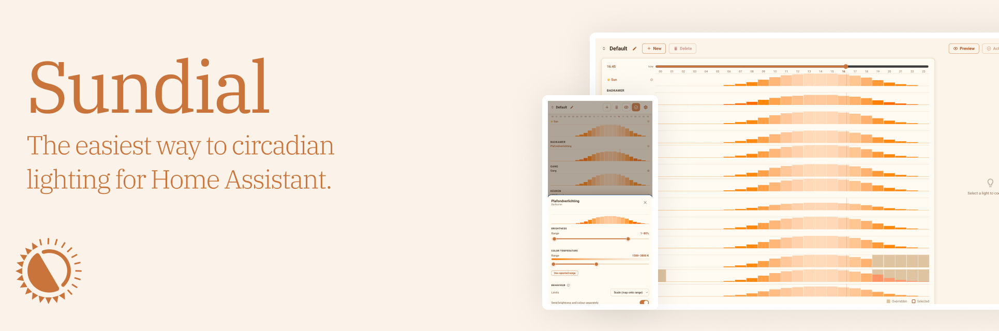
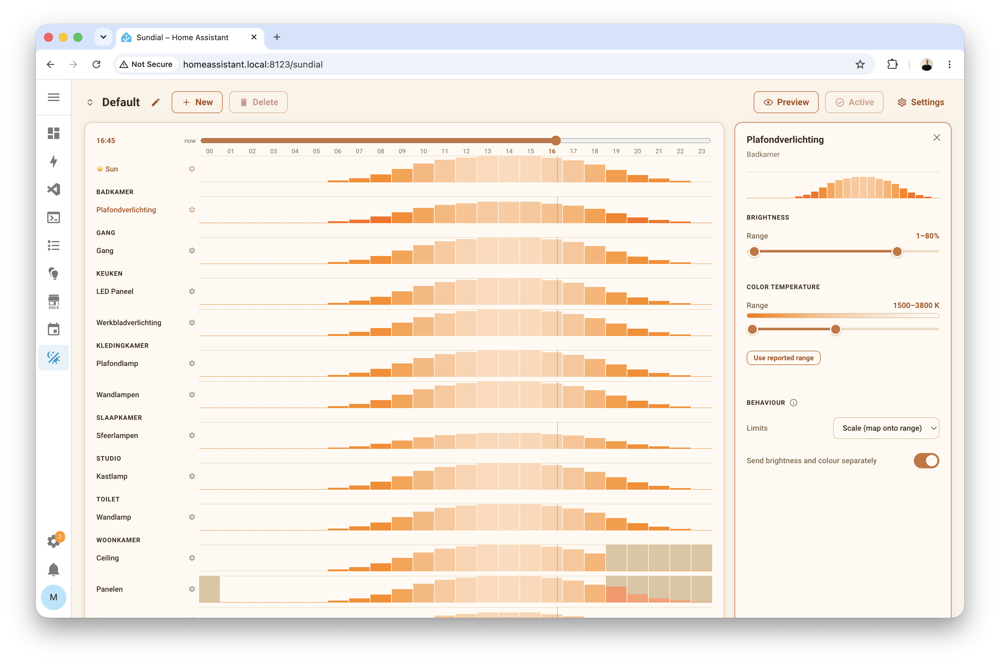

> The easiest way to apply circadian lighting to your home with Home Assistant.

Sundial adapts the brightness and colour temperature of your lights across the
day. By default, all lights that you enable Sundial for follow the sun; but you 
can easily pin your lights to specific values using the 24-hour **timeline**.
Everything can be configured in a purpose-built panel that works just as well on
a phone as on a desktop.

[](https://github.com/hacs/integration)
[](https://github.com/ameesme/sundial/releases)
[](LICENSE)


## How it works
### Schemas
A schema covers all your lights and your sun configuration. In it, you can define
how your lights behave over a 24-hour window. Multiple schemas can be set up and be
switched through using an automation, for example to have softer lighting during the
weekend.




### Sun
The sun drives all lights by default: lights get brighter towards noon and
warmer towards the night. Sunrise and sunset come from your home's location automatically
using Home Assistant's configured location. You can tune the ranges, times, and 
how gradual the transitions are, or override the used location altogether.

### Lights
Each light is a row on the timeline. It follows the sun within its own
brightness and temperature range, which defaults to what the bulb supports.

#### Overrides
Tap an hour in the timeline and hit **Override** to set exact values like brightness,
temperature, or an RGB colour. Sundial blends the values between hours.

## Other features
- Live **preview**: scrub through the day and optionally see your lights adapt as you 
  drag.
- **Manual Override**: changing a light by hand pauses Sundial for it, with an optional
  auto-reset that hands control back.
- **Per-light configurations**: change limits, temperature, color rendering or completely
  override a light's color on a per-hour basis.
- **Split commands**: supports lights that drop combined brightness + colour calls (e.g. IKEA),
  with a configurable delay.
- **Backup**: export and import the whole configuration as JSON.
- **Entities**: Master switch to toggle Sundial, as well as active-schema **select** entities
  to use in automations.

## Installation

**HACS** — add `https://github.com/ameesme/sundial` as a custom repository
(category *Integration*), install **Sundial**, restart Home Assistant.

**Manual** — copy `custom_components/sundial` into
`<config>/custom_components/` and restart.

Then: **Settings → Devices & Services → Add Integration → Sundial**, pick the
lights to control, and open **Sundial** in the sidebar. You can now configure your
schema.

## Exposed Services

- `sundial.apply` — have Sundial apply the scheduled values immediately
  (optionally per light, with `turn_on` to light up lights that are off).
- `sundial.set_manual_control` — pause or resume Sundial for given lights.

## Noteworthy files

| File             | Responsibility                                                 |
| ---------------- | -------------------------------------------------------------- |
| `engine.py`      | Math: sun curve, hourly anchors, cyclic interpolation.         |
| `coordinator.py` | Runtime: scheduling, applying values, override tracking.        |
| `interceptor.py` | Flags manual control from explicit `light.turn_on` calls.       |
| `models.py`      | JSON-serialisable dataclasses (schema, sun, lights, settings).  |
| `panel.py`       | Sidebar panel, static asset, WebSocket API.                     |
| `store.py`       | Persistence via HA's `Store` (`<config>/.storage/sundial`).     |

## Is it any good?
It's pretty good! I have been using Sundial intensively during its development
and it is now controlling all 40+ fixtures in my house reliably.

## Development

```bash
# Python: lint + pure-logic tests (no Home Assistant required)
ruff check .
python -m pytest

# Frontend (Lit + TypeScript, built with Vite)
cd frontend
npm install
npm run build   # type-check + bundle into custom_components/sundial/frontend/dist
npm run dev     # dev harness on :5173 — the real panel against a mock backend
```

The dev harness runs the full panel in a plain browser with fake lights and a
TypeScript port of the engine — no Home Assistant needed. Re-run
`npm run build` and commit the regenerated bundle whenever the frontend
changes; CI fails if the committed bundle is stale.

**Releasing** — bump `version` in `custom_components/sundial/manifest.json`,
commit, tag `vX.Y.Z`, push the tag. The release workflow validates the tag and
bundle, then publishes a zip.

## Special thanks
This project was inspired by and partially based on Bas Nijholt's incredible 
[Adaptive Lighting](https://github.com/basnijholt/adaptive-lighting) which I have
been using for a long time. I was looking for a more beginner-friendly solution
for some friends, and decided to build my own. Attribution is added to all files that can
be considered derivatives.

## LLM Disclaimer
This project was created with the help of Claude and careful manual testing.

## License
MIT
